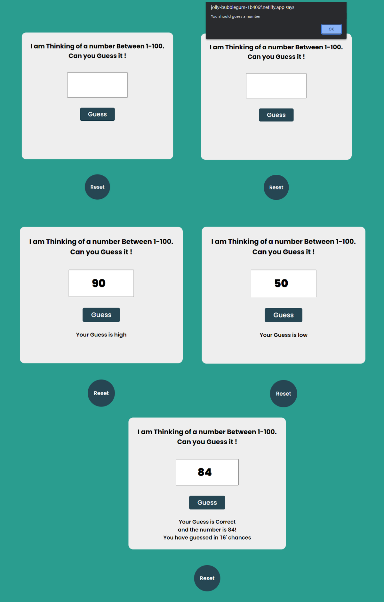

# Guess My Number

## Table of Contents

- [Links](#links)
- [Description](#description)
- [Screenshot](#screenshot)
- [Demo](#demo)
- [Features](#features)
- [Technologies Used](#technologies-used)
- [Usage](#usage)
- [What I Learned](#what-i-learned)
- [Contributing](#contributing)

## Links

- Solution URL: [GitHub Repository](https://github.com/aruntutter/guess-my-number)
- Live Demo: [Live Demo URL](https://aruntutter.github.io/guess-my-number/)

## Description

Guess My Number is a simple number guessing game where the player tries to guess a randomly generated number within a given range.

## Screenshot

## Demo

You can try the live demo of Guess My Number [here](https://jolly-bubblegum-1b406f.netlify.app). Have fun guessing the number!

## Features

- Randomly generates a number between 1 and 100 for the player to guess.
- Provides feedback to the player if their guess is too high or too low.
- Keeps track of the number of guesses made by the player.
- Allows the player to reset the game and start a new round.

## Technologies Used

- HTML
- CSS
- FlexBox
- JavaScript

## Usage

1. Open the game in a web browser.
2. The game will generate a random number between 1 and 100.
3. Enter your guess in the input field and click the "Guess" button.
4. The game will provide feedback on whether your guess is too high or too low.
5. Continue guessing until you guess the correct number.
6. The game will display the number of guesses made.
7. Click the "Reset" button to start a new round of the game.

## What I Learned

While working on this project, I learned how to:

- Generate random numbers in JavaScript using `Math.random()`.
- Manipulate the DOM to display messages and update the game state.
- Handle user input and perform validation.
- Use event listeners to listen for button clicks.
- Reset the game state for a new round.

## Contributing

Contributions to Guess My Number are welcome! If you have suggestions for new features, find any issues, or want to improve the code, feel free to submit a pull request.
